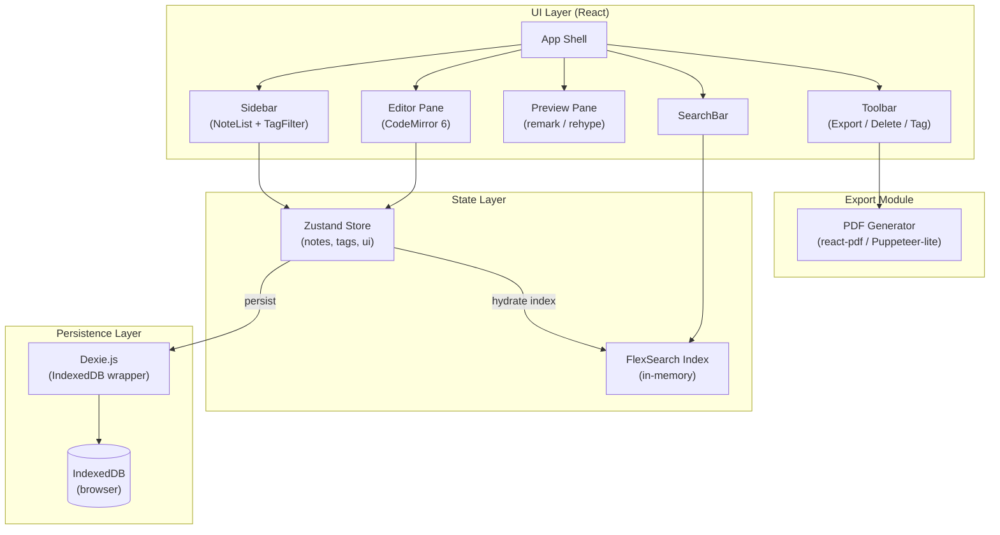

# Architecture

## High-Level Diagram



## Module Descriptions

| Module | Responsibility |
|---|---|
| **App Shell** | Layout orchestration, routing (hash-based), keyboard shortcuts |
| **Sidebar** | Note list sorted by `updatedAt`, tag filter chips, new-note button |
| **Editor Pane** | CodeMirror 6 instance; emits content changes to Store |
| **Preview Pane** | Renders current note markdown via remark pipeline; synced scroll |
| **SearchBar** | Debounced query → FlexSearch → highlights results in Sidebar |
| **Toolbar** | Tag editor popover, delete/restore, PDF export trigger |
| **Zustand Store** | Single source of truth; actions: `createNote`, `updateNote`, `deleteNote`, `setFilter` |
| **FlexSearch Index** | Rebuilt on hydration and incrementally updated on save |
| **Dexie.js** | Schema-versioned IndexedDB wrapper; tables: `notes`, `tags` |
| **PDF Generator** | Converts rendered HTML snapshot to PDF blob via `@react-pdf/renderer` |

## Data Model

```typescript
interface Note {
  id: string;          // nanoid
  title: string;
  body: string;        // raw markdown
  tags: string[];
  createdAt: number;   // unix ms
  updatedAt: number;
  deletedAt?: number;  // soft-delete
}

interface Tag {
  id: string;
  label: string;
  color: string;
}
```
